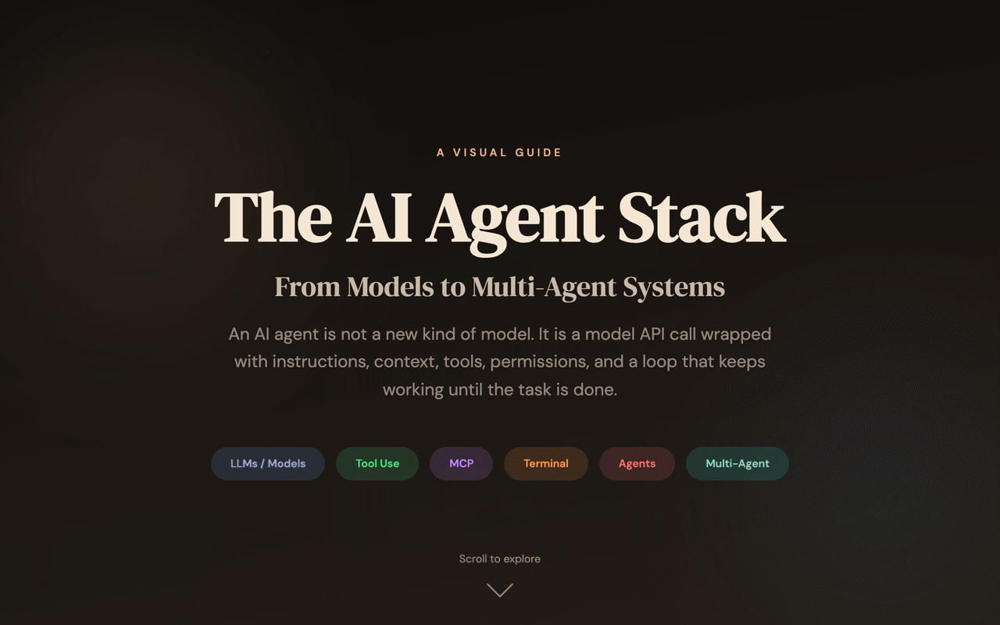

<p>
  
</p>

# The AI Agent Stack

**A Visual Guide — From Models to Multi-Agent Systems**

[**Live Site**](https://rusi.github.io/ai-agent-stack)

---

An interactive scrollytelling website that explains how AI agents actually work. Built for engineers, leaders, and anyone who wants to understand the architecture behind tools like Claude Code, Cursor, Copilot, and Codex.

> An AI agent is not a new kind of model. It is a model API call wrapped with instructions, context, tools, permissions, and a loop that keeps working until the task is done.

## What You'll Learn

1. **The Model** — LLMs are inference engines, not autonomous thinkers
2. **Tool Use** — Structured output lets models call functions and take action
3. **Context & Instructions** — `AGENTS.md`, `CLAUDE.md`, and how policy shapes behavior
4. **The Autonomous Loop** — Plan → Act → Observe → Repeat (what makes an agent an agent)
5. **Orchestration** — Multi-agent patterns: orchestrators, roles, and delegation
6. **Deployment** — Where everything runs: local filesystem, cloud APIs, MCP servers, and boundaries

Plus a **product comparison** (Claude Code, Codex, Cursor, Copilot, Gemini, OpenCode) and a **governance checklist** for teams deploying agents.

## Running Locally

No build step needed:

```bash
python3 -m http.server 8090
# open http://localhost:8090
```

## Built With

[Claude](https://claude.ai) + [Codex](https://openai.com/codex/) + [Gemini](https://gemini.google.com)

## License

MIT
